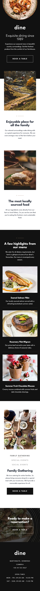
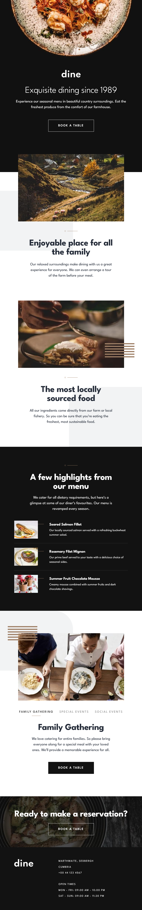
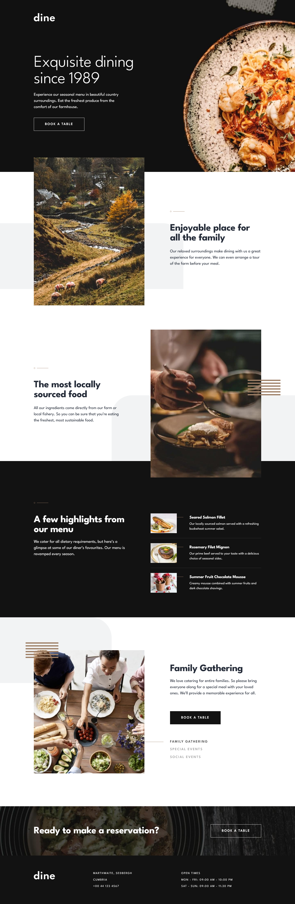
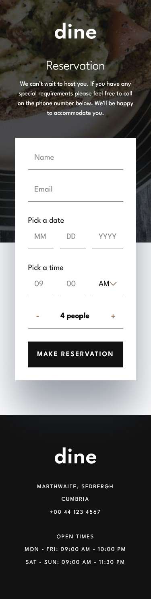
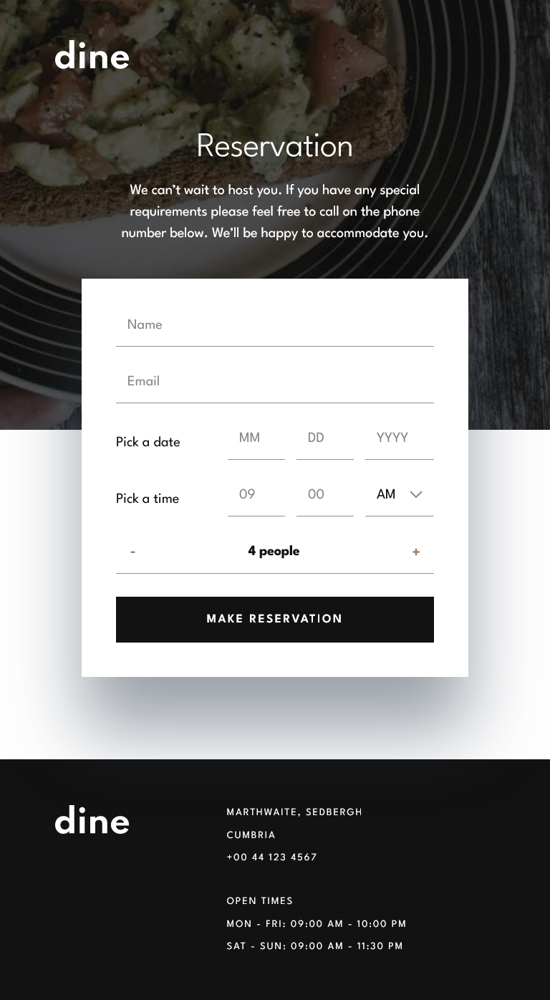
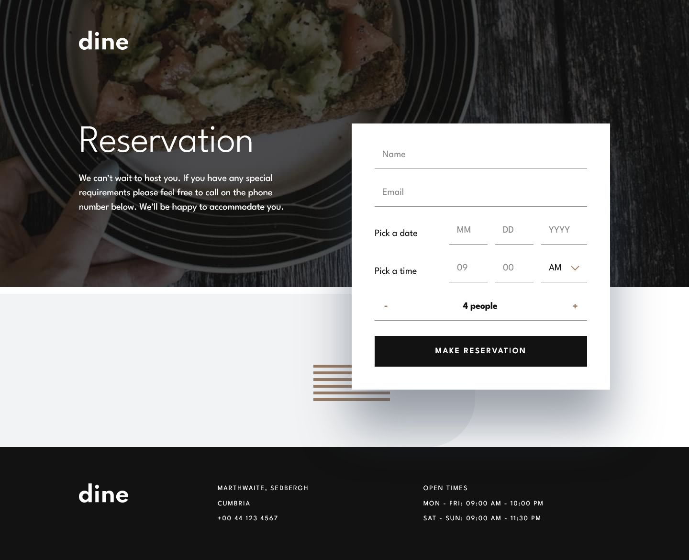

# Frontend Mentor - Dine Website Challenge solution

This is a solution to the [Dine Website Challenge challenge on Frontend Mentor](https://www.frontendmentor.io/challenges/dine-restaurant-website-yAt7Vvxt7). Frontend Mentor challenges help you improve your coding skills by building realistic projects.

## Links

- Solution URL: [Frontend Mentor Solution Page](https://www.frontendmentor.io/solutions/dine-restaurant-website-hs-Yr21pIz)
- Live Site URL: [GitHub Pages Site](https://karolbanat.github.io/dine-restaurant-website/)

## Useful resources

- [Custom Select](https://moderncss.dev/custom-select-styles-with-pure-css/)
- [How to get number of days in month](https://stackoverflow.com/questions/1184334/get-number-days-in-a-specified-month-using-javascript)
- [Spingbutton](https://www.w3.org/WAI/ARIA/apg/patterns/spinbutton/)

## Author

- Frontend Mentor - [@karolbanat](https://www.frontendmentor.io/profile/karolbanat)

## Screenshots

